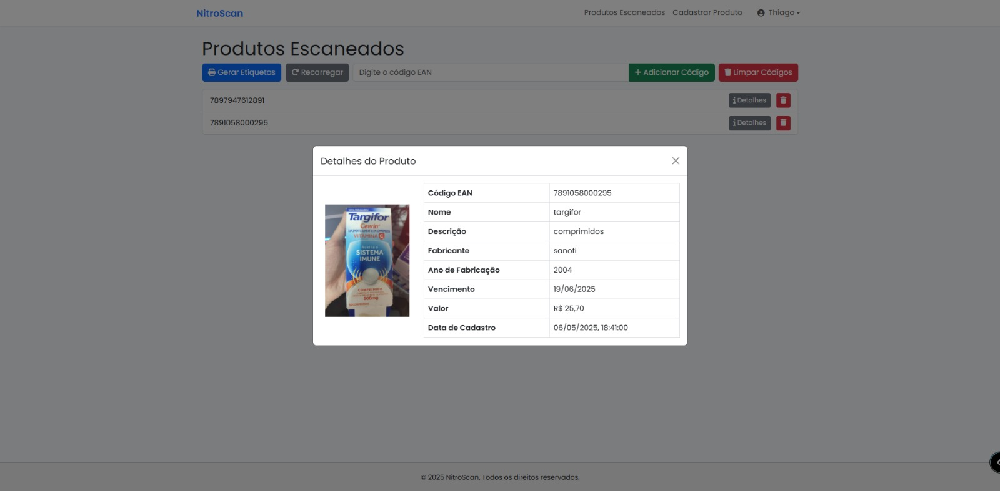
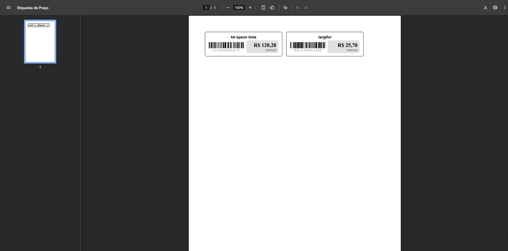
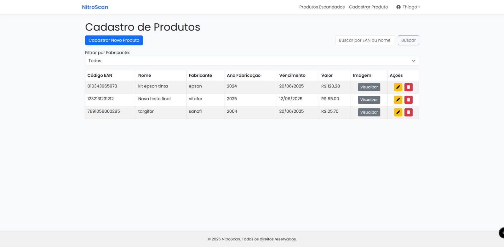

# 🔥 NitroScan

NitroScan é um sistema de escaneamento de códigos de produtos em tempo real, desenvolvido em **Laravel**. Ele oferece suporte tanto para plataformas **web** quanto **mobile**, utilizando uma API robusta para facilitar a integração e a comunicação entre sistemas.

---

## 🚀 Funcionalidades

- 📷 Escaneamento de códigos de barras (EAN) em tempo real
- 💾 Cadastro, edição e exclusão de produtos
- 🌐 Interface web responsiva e mobile-friendly
- 🔐 Autenticação de usuários
- 📄 Geração de etiquetas em PDF
- 📱 Aplicativo mobile integrado via API

---

## 🖼️ Telas do Sistema

### Cadastro de Produto


### Edição de Produto


### Lista de Produtos Escaneados


### Detalhes do Escaneamento


### Etiqueta PDF


### Tela Inicial (Home)


### Tela de Login


### Scanner em Web/Mobile


### Versão Mobile do App


### Lista de Produtos


### Ícone do Produto


### Tela de Scanner


---

## ⚙️ Tecnologias Utilizadas

- Laravel 10+
- PHP 8.x
- MySQL
- Laravel Sanctum (para autenticação via API)
- JavaScript / Vue.js (opcional para frontend dinâmico)
- HTML + CSS
- API RESTful
- Scanner de código de barras (via JavaScript ou app mobile)

---

## 📲 Como Executar

1. Clone o repositório:
   ```bash
   git clone https://github.com/seu-usuario/nitroscan.git
   cd nitroscan
   ```

2. Instale as dependências:
   ```bash
   composer install
   ```

3. Copie o arquivo `.env` e configure:
   ```bash
   cp .env.example .env
   php artisan key:generate
   ```

4. Configure seu banco de dados no `.env` e execute as migrations:
   ```bash
   php artisan migrate
   ```

5. Inicie o servidor:
   ```bash
   php artisan serve
   ```

---

## 🤝 Contribuindo

Contribuições são bem-vindas! Sinta-se à vontade para abrir issues ou enviar pull requests com melhorias, correções ou novas funcionalidades.

---

## 📄 Licença

Este projeto está sob a licença MIT. Veja o arquivo MIT para mais detalhes.

---

## 🦸 Criado por

Feito com ❤️ por **Thiago Araujo**
