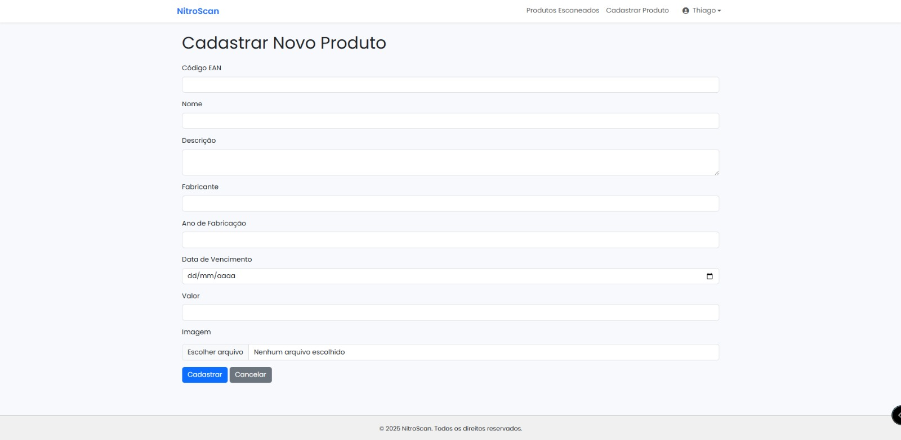

<p align="center">
  
</p>

<h1 align="center">📱 Nitro</h1>

<p align="center">
  NitroScan é um sistema de escaneamento de códigos de produtos em tempo real, desenvolvido em **Laravel**. Ele oferece suporte tanto para plataformas **web** quanto **mobile**, utilizando uma API robusta para facilitar a integração e a comunicação entre sistemas.
</p>

---

## 📱 NitroScan Mobile

<a href="https://github.com/lThiag0/nitroscan_mobile" alt="NitroScan Mobile app" target="_blank">NitroScan Mobile app</a>

---

## 🚀 Funcionalidades

- 📷 Escaneamento de códigos de barras (EAN) em tempo real
- 💾 Cadastro, edição e exclusão de produtos
- 🌐 Interface web responsiva e mobile-friendly
- 🔐 Autenticação de usuários
- 📄 Geração de etiquetas em PDF
- 📱 Aplicativo mobile integrado via API

---

## 🖼️ Telas do Sistema

### Cadastro de Produto


### Edição de Produto


### Lista de Produtos Escaneados


### Detalhes do Escaneamento


### Etiqueta PDF


### Tela Inicial (Home)


### Tela de Login


### Lista de Produtos


### Ícone do Produto

- JavaScript / Vue.js (opcional para frontend dinâmico)
- HTML + CSS
- API RESTful
- Scanner de código de barras (via JavaScript ou app mobile)

---

## 📲 Como Executar

1. Clone o repositório:
   ```bash
   git clone https://github.com/lThiag0/nitroscan.git
   cd nitroscan
   ```

2. Instale as dependências:
   ```bash
   composer install
   ```

3. Copie o arquivo `.env` e configure:
   ```bash
   cp .env.example .env
   php artisan key:generate
   ```

4. Configure seu banco de dados no `.env` e execute as migrations:
   ```bash
   php artisan migrate
   ```

5. Inicie o servidor por ip do pc para funciona as Api:
   ```bash
   php artisan serve --host=0.0.0.0 --port=8000
   ```

6. Para Funciona tudo direito verifique que o seu php.ini esta assim:
   ```bash
   file_uploads = On
   upload_max_filesize = 10M
   post_max_size = 12M
   extension = gd
   ```

7. Login para funcionario:
   ```bash
   faça o comando seeder para funcionario e criar link de produtos:
   php artisan db:seed
   php artisan storage:link

   email: thiago@hotmail.com
   senha: 123456
   senha para db: $2y$12$6gPT.F7OKOHNKzvjcdaYPO0obgSDBraImcTfv/DzBCH2A4sdbVCtC
   ```

---

## 🤝 Contribuindo

Contribuições são bem-vindas! Sinta-se à vontade para abrir issues ou enviar pull requests com melhorias, correções ou novas funcionalidades.

---

## 📄 Licença

Este projeto está sob a licença MIT. Veja o arquivo MIT para mais detalhes.

---

## 🦸 Criado por

Feito com ❤️ por **Thiago Araujo**
